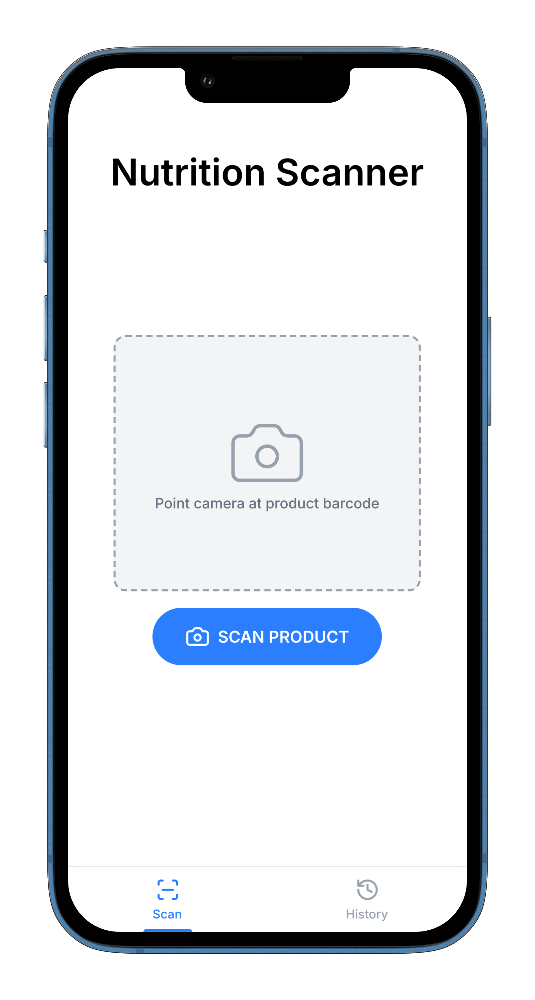
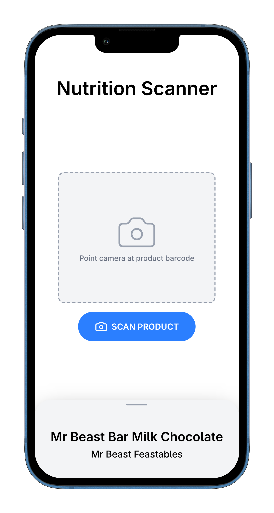
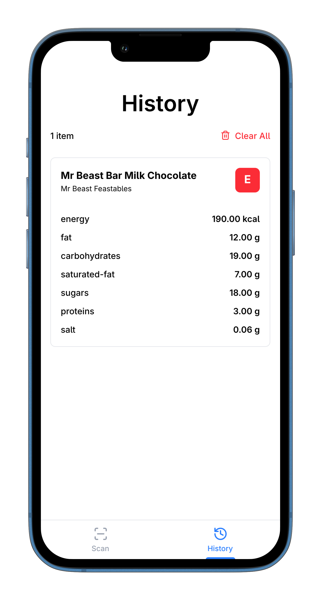

# NutriScan

[](https://nutriscan.vercel.app)
[](https://nextjs.org/)
[](https://www.typescriptlang.org/)

Scan product barcodes with your phone camera and instantly get nutrition information with color-coded health indicators. No signup, no tracking, all data stays on your device.

**[Try it now →](https://nutriscan.vercel.app)**

---

## Screenshots

<table>
  <tr>
    <td><br/><sub>Real-time scanning</sub></td>
    <td><br/><sub>Traffic light indicators</sub></td>
    <td><br/><sub>Full nutrient breakdown</sub></td>
    <td><br/><sub>Scan history</sub></td>
  </tr>
</table>

---

## Features

- **Real-time Barcode Scanning** - Point and scan, works with most product barcodes
- **Health Indicators** - UK Traffic Light System shows if products are healthy at a glance
- **Detailed Nutrition** - Complete breakdown of nutrients per 100g
- **Scan History** - Keep track of products you've checked (stores up to 100 locally)
- **Privacy-First** - No backend, no tracking, no accounts - your data never leaves your device
- **Mobile Optimized** - Responsive design built for phones first

---

## Tech Stack

- **[Next.js 15](https://nextjs.org/)** - React framework with App Router for optimal performance
- **[TypeScript](https://www.typescriptlang.org/)** - Type safety and better developer experience
- **[Quagga2](https://github.com/ericblade/quagga2)** - Reliable JavaScript barcode scanner supporting EAN-13, UPC-A, and more
- **[Open Food Facts API](https://world.openfoodfacts.org/)** - Open database with 3M+ food products worldwide
- **localStorage** - Client-side storage for scan history

---

## Health Indicators

Based on UK Food Standards Agency guidelines (per 100g):

| Nutrient          | 🟢 Green (Low) | 🟡 Amber (Medium) | 🔴 Red (High) |
| ----------------- | -------------- | ----------------- | ------------- |
| **Fat**           | ≤ 3g           | > 3g to ≤ 17.5g   | > 17.5g       |
| **Saturated Fat** | ≤ 1.5g         | > 1.5g to ≤ 5g    | > 5g          |
| **Sugars**        | ≤ 5g           | > 5g to ≤ 22.5g   | > 22.5g       |
| **Salt**          | ≤ 0.3g         | > 0.3g to ≤ 1.5g  | > 1.5g        |

---

## Getting Started

### Option 1: Quick Start (Recommended)

```bash
# Clone the repository
git clone https://github.com/0x0bito/nutriscan.git
cd nutriscan

# Install dependencies
npm install

# Build app
npm run build

# Run app
npm run start
```

Open [http://localhost:3000](http://localhost:3000) in your browser.

### Option 2: Docker

```bash
# Clone repository
git clone https://github.com/0x0bito/nutriscan.git
cd nutriscan

# Start with Docker
docker compose up --build
```

### Requirements

- **Node.js 20+** (for Option 1)
- **Docker** (for Option 2)
- **HTTPS or localhost** - Required for camera access

---

## Usage

1. Open the app and **grant camera permission**
2. **Point your camera** at a product barcode
3. **Scan automatically detects** the barcode
4. **Swipe up** for detailed breakdown
5. **View nutrition info** with color-coded health indicators
6. **Check history** tab to see previously scanned products

---

## Troubleshooting

### Camera Won't Start

- **Check browser permissions** - Make sure camera access is allowed
- **Use HTTPS or localhost** - Browsers block camera on insecure connections
- **Try another browser** - Chrome and Edge have best compatibility

### Product Not Found

- **Check barcode quality** - Make sure it's not damaged or obscured
- **Try better lighting** - Shadows can interfere with scanning
- **Search manually** - Visit [Open Food Facts](https://world.openfoodfacts.org/) to check if the product exists
- **Add it yourself** - Open Food Facts is community-driven, you can contribute missing products

### Scanning Issues

- **Hold steady** - Keep the barcode in frame for 2-3 seconds
- **Adjust distance** - Try moving closer or further from the barcode
- **Check barcode format** - App supports EAN-13, UPC-A, UPC-E, and Code 128

---

## Reporting Bugs

Open an issue with:

- Clear description of the problem
- Steps to reproduce
- Expected vs actual behavior
- Screenshots (if applicable)
- Browser and device info

## Feature Requests

Open an issue describing:

- The feature you'd like to see
- Why it would be useful
- How you envision it working

---

## Acknowledgments

- **[Open Food Facts](https://world.openfoodfacts.org/)** - Amazing open database powered by contributors worldwide
- **[Quagga2](https://github.com/ericblade/quagga2)** - Robust barcode scanning that just works
