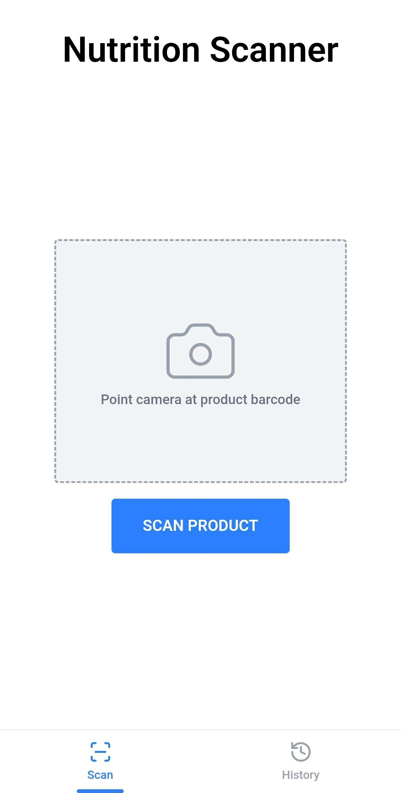
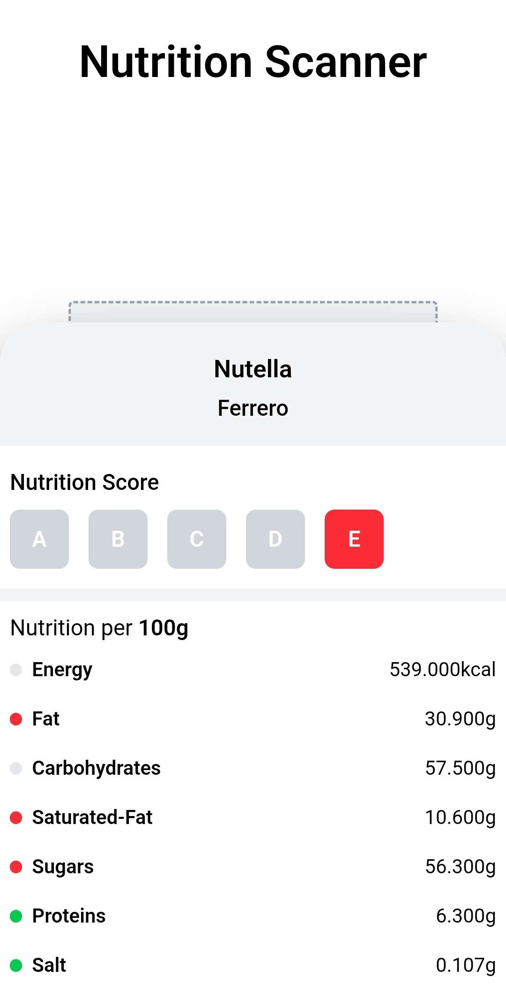
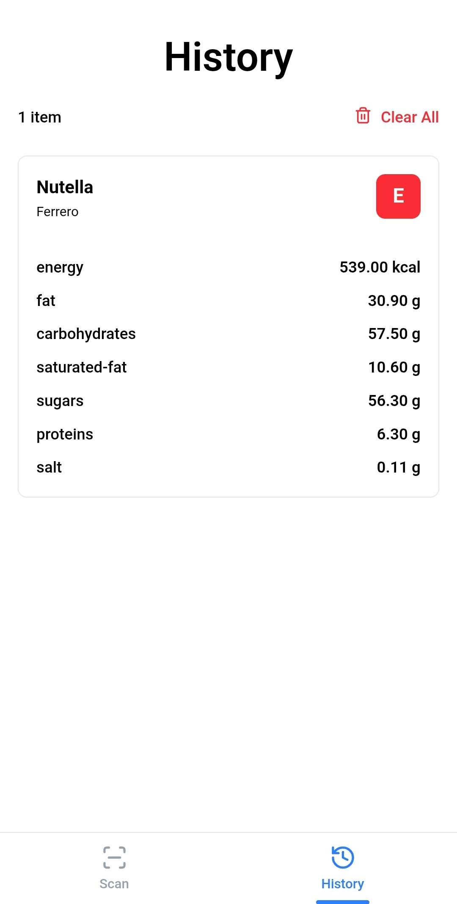

# NutriScan

A web app that scans product barcodes and displays nutrition information with color-coded health indicators.


## Screenshots

<table>
  <tr>
    <td></td>
    <td></td>
    <td></td>
  </tr>
</table>

## Health Indicators

Based on UK Food Standards guidelines (per 100g):

| Nutrient          | 🟢 Green (Low) | 🟡 Amber (Medium) | 🔴 Red (High) |
| ----------------- | -------------- | ----------------- | ------------- |
| **Fat**           | ≤ 3g           | > 3g to ≤ 17.5g   | > 17.5g       |
| **Saturated Fat** | ≤ 1.5g         | > 1.5g to ≤ 5g    | > 5g          |
| **Sugars**        | ≤ 5g           | > 5g to ≤ 22.5g   | > 22.5g       |
| **Salt**          | ≤ 0.3g         | > 0.3g to ≤ 1.5g  | > 1.5g        |


## Getting Started

### Requirements

- **Docker & Docker Compose**

```bash
# Clone repository
git clone https://github.com/0x0bito/nutriscan.git
cd nutriscan

# Start with Docker
docker compose up --build
```

## Troubleshooting

### Camera Won't Start

- **Check browser permissions** - Make sure camera access is allowed
- **Use HTTPS or localhost** - Browsers block camera on insecure connections follow this [article](https://medium.com/@Carmichaelize/enabling-the-microphone-camera-in-chrome-for-local-unsecure-origins-9c90c3149339) on how to enable Microphone/Camera in Chrome for Unsecure Origins

### Product Not Found

- **Add it yourself** - **[Open Food Facts](https://world.openfoodfacts.org/)** is community-driven, you can contribute missing products

### Scanning Issues

- **Adjust distance** - Try moving closer or further from the barcode
- **Supported formats** - EAN, UPC, Code 128, Code 39

## Acknowledgments

- **[Open Food Facts](https://world.openfoodfacts.org/)** - Amazing open database powered by contributors worldwide
- **[Quagga2](https://github.com/ericblade/quagga2)** - Robust barcode scanning that just works
